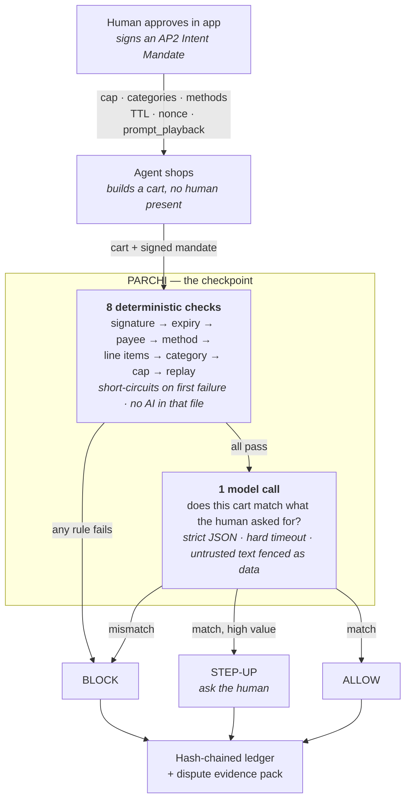

<div align="center">

# Parchi

### A permission layer for AI-initiated payments.

**No parchi, no purchase.**

[](https://github.com/DarkBird10020/parchi/actions/workflows/ci.yml)
[](https://www.python.org/downloads/)
[](tests/test_attacks.py)
[](tests/)
[](LICENSE)

*Razorpay AI Buildathon · Track 02 · AI Risk Manager*


</div>

---

In India, a **parchi** is a slip of paper that says you're allowed. Show the parchi,
you get through. Right now, when an AI spends your money, there is no parchi.

Razorpay shipped agents that spend money — agentic in-app checkout, UPI Reserve Pay,
Agent Studio. What nobody shipped is the layer that checks whether the spending was
*allowed*. Card networks verify that an agent is **genuine**; none of them verify
that a human approved **this specific purchase**. Agent-initiated transactions
already dispute at roughly 2.4× the rate of ordinary card-not-present ones, and the
merchant absorbs that first — with no reason code and no evidence to defend it.

**Parchi is that missing check.** Every agent purchase must carry a signed
[AP2 Intent Mandate](https://github.com/google-agentic-commerce/AP2): the human's
cap, categories, expiry, and the agent's own playback of what it understood the
human to ask for. Parchi verifies the purchase against that mandate *before*
authorisation and writes a hash-chained evidence record either way — so a merchant
can prove what was authorised when a customer says *"my agent did that, I didn't."*

> [!NOTE]
> Razorpay's Agent Studio already has a dispute-**response** agent. That one answers
> disputes on human transactions. Parchi **prevents and evidences** disputes on
> *agent* transactions. Different problem, and an unsolved one.

---

## Contents

[Quickstart](#quickstart) · [How it works](#how-it-works) · [Results](#results) ·
[The demo](#the-demo) · [Adversarial testing](#adversarial-testing) ·
[The slip](#the-slip) · [Repo layout](#repo-layout) ·
[Known limitations](#known-limitations)

---

## Quickstart

```bash
pip install -r requirements.txt

python data/generate.py      # 1,000 labelled agent purchases (deterministic, seed 7)
python eval/evaluate.py      # the results table below, plus eval/results.json
```

Two commands reproduce every number in this README. Three more, optional:

```bash
python tests/test_parchi.py   # 18 unit tests, no pytest needed
python tests/test_attacks.py  # 28 adversarial patterns, printed as a report
python demo/server.py         # http://127.0.0.1:8000 — the page in the video
```

Runs end to end with **no API key**. The one AI call has three backends, and
whichever ran is stamped on every verdict, ledger record and table:

| `--provider` | Backend | When |
| :--- | :--- | :--- |
| `heuristic` | Offline lexical stand-in | Default with no key. Reproducible, no network |
| `api` | Anthropic `claude-opus-5` | `ANTHROPIC_API_KEY` is set |
| `openai` | **Any OpenAI-compatible endpoint** — nano-gpt, OpenRouter, Together, local vLLM | `PARCHI_OPENAI_API_KEY` is set |
| `off` | Nothing. Always degrade | The failure you demo on camera |

To use an OpenAI-compatible endpoint (the model defaults to the GLM family and is
resolved against the endpoint's **live `/models` catalogue**, so a retired model
name cannot silently turn every row into a fallback):

```bash
cp .env.example .env                             # then put your key in .env
python -m parchi.models_cli --filter glm --pick  # browse and choose a model
python eval/evaluate.py --provider openai --limit 25 --timeout 30
```

`.env` is gitignored, the key is never written to the ledger or a log line, and
`PARCHI_MAX_CALLS` caps how many model calls one process may make — a runaway loop
over a 1,000-row batch is the realistic way a subscription gets burned.

> [!WARNING]
> A misconfigured endpoint does not crash this system, it **degrades** — and a
> degraded row still returns a verdict, so the batch completes and the table looks
> fine while nothing was called. `evaluate.py` therefore makes one live call before
> scoring and refuses to run if it comes back degraded. That check exists because
> the bug it catches happened. See [FAILURES.md](FAILURES.md) → entry 10.

---

## How it works



**Eight of the nine checks are plain code**, because rules are faster, cheaper and
auditable. The model answers exactly one question rules cannot: *does this cart
match what the human actually asked for?*

And there are **three answers, not two**. A system with only allow and block is a
filter. The third — **ask the human** — is what makes it a risk product, and it is
one `if` statement.

---

## Results

1,000 synthetic agent purchases, every row carrying a ground-truth label, scored
against both baselines. False positives are reported **in rupees**, because a
blocked genuine customer is money the merchant lost.

| Approach | Catches violations | Blocks good customers | Cost of the mistakes |
| :--- | :--- | :--- | :--- |
| Allow everything | 0/260 (0%) | 0 | **₹17,05,171** paid out on violations |
| Block all agent traffic | 260/260 (100%) | 740 | **₹34,43,816** of good revenue gone |
| Rules only *(the day-2 baseline)* | 235/260 (90.4%) | 0 | ₹1,20,785 paid out on violations |
| **Parchi** *(rules + one model call)* | **260/260 (100%)** | **0** | **₹0** |


Plus **40/40** legitimate high-value carts routed to a human instead of
auto-approved, and a ledger chain intact across all 1,000 records.

The 25 violations rules alone miss are all the same case: a prompt injection on the
product page that adds a line item **inside an allowed category and under the cap**.
No rule can see it. That is the entire reason the model call exists.

> [!IMPORTANT]
> **Read this before quoting the Parchi row.** It was produced by the offline
> `heuristic` intent matcher, not by a model — this repo runs end to end with no API
> key, and that number is not an LLM number. Every table, ledger record and evidence
> pack is stamped with the provider that produced it — `heuristic`,
> `api:claude-opus-5`, or `openai:<model>`.
>
> A **25-row sample** against `z-ai/glm-4.7-flash` does return recall 100%,
> precision 100%, 0 degraded — but 25 rows is 4 violations, which cannot tell 100%
> apart from 96%. The full 1,000-row model run has not been done. See
> [FAILURES.md](FAILURES.md) → entry 10 for the three bugs that first sample
> uncovered, and *Still unsolved* for what remains unmeasured.

### When the model dies

```bash
python eval/evaluate.py --provider off
```

Parchi degrades to exactly the rules-only number (235/260, ₹0 of false-positive
cost), keeps logging every decision, and auto-approves nothing: a high-value cart
whose intent check could not run becomes `STEP_UP` — not `ALLOW`, and not `BLOCK`.
**Failing closed should not mean burning the customer.**

---

## The demo

```bash
python demo/server.py     # → http://127.0.0.1:8000
```

Eight scenarios, each a real `POST /api/authorize`. Every check and its reason is
shown, the evidence pack is the JSON a merchant would send to an issuer, and the
ledger pane verifies its own hash chain — with a **Tamper** button, because showing
it beats claiming it.


The screenshot is the case that matters: **every rule passes** — right category,
under the cap, valid slip, unspent nonce — and the one model call is what catches
the add-on the product page talked the agent into.

---

## Adversarial testing

`python tests/test_attacks.py` runs **28 named attack patterns**, each with the
verdict Parchi must return, and prints a report.

| Category | Patterns |
| :--- | :--- |
| Forging & tampering | raise the cap · widen categories · wrong key · signature swap · garbage / empty signature |
| Time | expired by one second · TTL runs backwards · issued in the future · still-valid boundary |
| Identity | payee substitution |
| Amount arithmetic | negative line offset · zero-value cart · free-item padding · cap boundary · step-up boundary · line flood |
| String tricks | method / category case variance · whitespace padding · **Cyrillic homoglyph category** |
| Replay | same slip new cart · nonce collision · a blocked cart must not burn the slip |
| Prompt injection | in the product page · in a line description · **while the model is dead** |

**Six of these got through on the first run**, including payee substitution (a valid
slip for one shop authorised a purchase at *any* other) and a zero-value cart. Two
more were passing *for the wrong reason* — the model happened to catch what no rule
did, so a model outage would have re-opened both. Fixing them is why there are eight
deterministic checks instead of six. The full post-mortem is in
[FAILURES.md](FAILURES.md).

One pattern is recorded as a **known blind spot** rather than quietly dropped:
`quantity-inflation` — five identical allowed pairs, under the cap, still reads as
in-scope.

### Nothing merges that breaks the checkpoint

A wrong verdict here is either a fraudulent purchase that went through or a real
customer who was refused, so the repo does not rely on anyone remembering to run
things.

- **[`ci.yml`](.github/workflows/ci.yml)** — ruff, unit tests on Python
  3.11/3.12/3.13, all 28 attack patterns, a check that the generated dataset is
  **byte-identical** for a fixed seed, the scoreboard gate, a ledger-chain
  verification across all 1,000 records, and a job that boots the demo server and
  asserts every scenario's verdict.
- **`evaluate.py --gate`** encodes the results as *invariants*, not a frozen score:
  Parchi never catches fewer violations than the rules baseline, never blocks a
  customer the rules would have allowed, precision stays at 100%, every high-value
  legitimate cart still reaches a human, and the chain still verifies.
- **[`.coderabbit.yaml`](.coderabbit.yaml)** — per-file review instructions written
  for this codebase: canonical-bytes stability in `mandate.py`, bypass classes in
  `checks.py`, prompt-injection surface in `intent_match.py`, append-only invariants
  in `ledger.py`.

---

## The slip

The mandate is Google's **AP2 Intent Mandate**, not an invented format — it already
defines this object for the case where a human is not present at purchase time.

| Field | Holds |
| :--- | :--- |
| `payer_id` / `payee_id` | Who is buying, who is selling |
| `allowed_methods` | Which instruments the agent may use (`upi`, `card`) |
| `max_amount_paise` | The spending cap. Paise, never floats — **money is integers** |
| `allowed_categories` | What kind of thing may be bought |
| `prompt_playback` | The agent's own words for what the human asked. This is the field the AI check compares against |
| `expires_at` | TTL. AP2 guidance suggests around 24 hours |
| `nonce` | One-time use, so a mandate cannot be replayed |
| `signature` | Ed25519 over canonical JSON, signed by the human's key |

[**`docs/upi-mapping.md`**](docs/upi-mapping.md) maps every field onto **UPI Reserve
Pay**, including the two fields the rail has no equivalent for —
`allowed_categories` and `prompt_playback` — which are exactly the two Parchi spends
its intelligence on.

---

## Repo layout

Small enough that a reviewer can read the whole thing in ten minutes. That is a feature.

```
parchi/
├── parchi/
│   ├── mandate.py       # AP2 Intent Mandate: dataclass, canonical bytes, sign, verify
│   ├── checks.py        # the 8 deterministic checks. no AI in this file
│   ├── intent_match.py  # the ONE model call: timeout, fallback, injection fencing
│   ├── ledger.py        # hash-chained audit log + verify_chain()
│   ├── engine.py        # orchestrates: checks → model → verdict → ledger
│   └── evidence.py      # dispute evidence pack builder
├── data/generate.py     # 1,000 labelled agent purchases, deterministic
├── eval/evaluate.py     # precision, recall, false-positive rupee cost, baselines
├── tests/
│   ├── test_parchi.py   # 18 unit tests, including one that tampers with the ledger
│   └── test_attacks.py  # 28 adversarial patterns with the verdict each must get
├── demo/                # fastapi server + the page in the video
├── docs/upi-mapping.md  # mandate fields mapped onto UPI Reserve Pay
└── FAILURES.md          # what broke, what it actually was, what it cost
```

### Why anyone should believe the log

Every ledger record hashes the one before it. `verify_chain()` walks the file, and
`test_tampering_with_an_old_record_breaks_the_chain` edits one old record and proves
the chain reports it. The demo page has a **Tamper** button for the same reason.

---

## Known limitations

Named on purpose. Four days, and these need infrastructure a demo cannot have.
Pretending a hackathon build is production-grade is the actual red flag.

- **Keys live in memory.** No hardware-backed key storage, no 90-day rotation. The
  demo server generates a keypair at startup; a real payer key belongs in a secure
  element or wallet.
- **Nonces are an in-process set.** Replay protection does not survive a restart and
  would need a shared store to survive more than one instance.
- **No agent registry.** Parchi verifies that a human approved this purchase. It does
  not verify *which* agent is presenting the slip — that is the half the card
  networks are already building, and the two are complementary.
- **No real card-network or UPI integration.** The field mapping is on paper; wiring
  it needs a PSP sandbox and a key-provisioning story.
- **Synthetic data.** 1,000 generated rows with known labels. Real agent traffic is
  messier, and the intent check is the part that would move first.
- **No multi-agent consensus** on high-value approvals. The step-up path hands those
  to a human instead — cheaper and, for four days, more honest.
- **The intent check is one call with no retry.** In front of a payment, a slow
  answer is a wrong answer; the deterministic fallback *is* the retry policy.

---

<div align="center">

**[FAILURES.md](FAILURES.md)** — every bug, what I first assumed, and what it actually was<br>
**[docs/upi-mapping.md](docs/upi-mapping.md)** — the mandate on Indian rails

<sub>Built for the Razorpay AI Buildathon · Track 02 · MIT licensed</sub>

</div>
