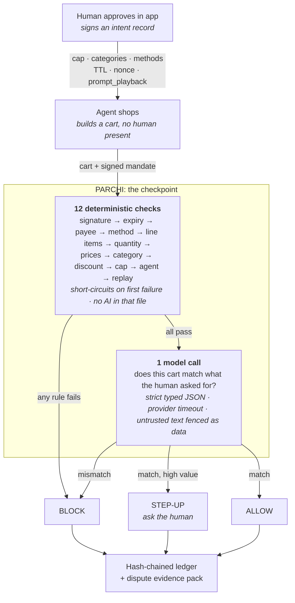
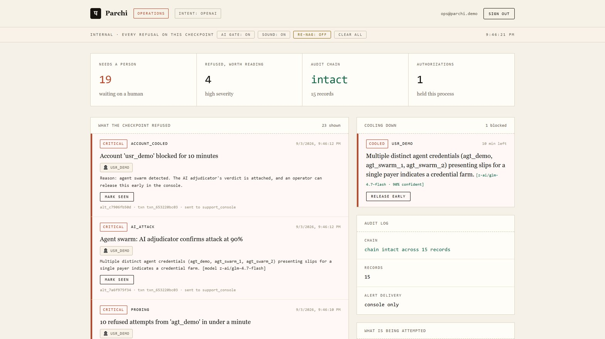

<div align="center">

# Parchi

### A permission layer for AI-initiated payments.

**No parchi, no purchase.**

[](https://github.com/DarkBird10020/parchi/actions/workflows/ci.yml)
[](https://www.python.org/downloads/)
[](tests/test_attacks.py)
[](tests/)
[](LICENSE)

*Razorpay AI Buildathon · Track 02 · AI Risk Manager*

<div align="center">

**[Pitch script](docs/pitch-video.md)** · **[Submission notes](docs/submission.md)** · **[What broke](FAILURES.md)**

</div>


</div>

---

In India, a **parchi** is a slip of paper that says you're allowed. Show the parchi,
you get through. Right now, when an AI spends your money, there is no parchi.

Razorpay has launched Agentic Payments backed by UPI Reserve Pay, while Agent Studio
automates merchant operations. Agentic payment systems still need transaction-level
enforcement that checks whether the actual cart remains inside signed payer intent.

**Parchi is that missing check.** Every agent purchase must carry a signed
[AP2-inspired intent record](https://github.com/google-agentic-commerce/AP2): the human's
cap, categories, expiry, and the agent's own playback of what it understood the
human to ask for. Parchi verifies the purchase against that mandate *before*
authorisation and writes a hash-chained evidence record either way, so a merchant
can prove what was authorised when a customer says *"my agent did that, I didn't."*

### Whose money this saves

This is written from the payer's side of the slip, so it is worth being explicit
about who is out of pocket when it fails, because that is the party paying for
it.

The checkpoint sits where Razorpay already sits: between the agent and the
merchant. When bad agent traffic clears, the merchant ships goods against a
purchase the payer did not authorise, and then loses it twice. Once to the
chargeback, and once to the scheme fees and the dispute ratio that follows.
Agent-initiated volume makes that worse in a specific way: an agent can present
a hundred plausible carts in a minute, and every one it gets through is a
dispute the merchant has no evidence to contest, because "the agent decided to"
is not a defence anybody has had to answer before.

The three numbers this repo reports are all merchant money. Violations that
cleared are chargebacks waiting to happen. False blocks are revenue refused at
checkout. Carts sent to a human are the ones worth the friction. That is why
the scoreboard is denominated in rupees rather than in percentages.

> [!NOTE]
> Razorpay's Agent Studio already has a dispute-**response** agent. That one answers
> disputes on human transactions. Parchi **prevents and evidences** disputes on
> *agent* transactions. Different problem, and an unsolved one.

---

## Contents

[Quickstart](#quickstart) · [How it works](#how-it-works) · [Results](#results) ·
[The demo](#the-demo) ·
**[The operations console — the employee side](#the-operations-console--the-employee-side-of-the-product)** ·
[Patterns one cart cannot show](#the-patterns-one-cart-cannot-show) ·
[What earns a block](#what-earns-the-ten-minute-block) ·
[Adversarial testing](#adversarial-testing) ·
[Attacks I didn't write](#attacks-written-by-something-that-has-not-seen-the-rules) ·
[The slip](#the-slip) ·
[Lying about the price](#lying-about-the-price) ·
[Why this and not the alternative](#why-this-and-not-the-obvious-alternative) ·
[Repo layout](#repo-layout) · [Known limitations](#known-limitations)

---

## Quickstart

```bash
pip install -r requirements.txt

python data/generate.py      # 1,000 labelled agent purchases (deterministic, seed 7)
python eval/evaluate.py      # the results table below, plus eval/results.json
```

Two commands reproduce every number in this README. Three more, optional:

```bash
python -m pytest tests/ -q    # 363 tests
python tests/test_attacks.py  # 48 adversarial patterns, printed as a report
python demo/server.py         # http://127.0.0.1:8000, the page in the video
```

Runs end to end with **no API key**. The one AI call has three backends, and
whichever ran is stamped on every verdict, ledger record and table:

| `--provider` | Backend | When |
|:--- |:--- |:--- |
| `heuristic` | Offline lexical stand-in | Default with no key. Reproducible, no network |
| `api` | Anthropic `claude-opus-5` | `ANTHROPIC_API_KEY` is set |
| `openai` | **Any OpenAI-compatible endpoint**, ElectronHub, OpenRouter, Together, local vLLM | `PARCHI_OPENAI_API_KEY` is set |
| `off` | Nothing. Always degrade | The failure you demo on camera |

To use an OpenAI-compatible endpoint (the model defaults to the GLM family and is
resolved against the endpoint's **live `/models` catalogue**, so a retired model
name cannot silently turn every row into a fallback):

```bash
cp .env.example .env                             # then put your key in .env
python -m parchi.models_cli --filter glm --pick  # browse and choose a model
python eval/evaluate.py --provider openai --limit 25 --timeout 30
```

`.env` is gitignored, the key is never written to the ledger or a log line, and
`PARCHI_MAX_CALLS` caps how many model calls one process may make: a runaway loop
over a 1,000-row batch is the realistic way a subscription gets burned.

> [!WARNING]
> A misconfigured endpoint does not crash this system, it **degrades**, and a
> degraded row still returns a verdict, so the batch completes and the table looks
> fine while nothing was called. `evaluate.py` therefore makes one live call before
> scoring and refuses to run if it comes back degraded. That check exists because
> the bug it catches happened. See [FAILURES.md](FAILURES.md) → entry 10.

---

## How it works



**Twelve of the thirteen checks are plain code**, because rules are faster, cheaper and
auditable. The model answers exactly one question rules cannot: *does this cart
match what the human actually asked for?* The new quantity and agent-identity
checks close two gaps that used to require the model.

And there are **three answers, not two**. A system with only allow and block is a
filter. The third, **ask the human**, is what makes it a risk product, and it is
one `if` statement.

---

## Results

1,000 synthetic agent purchases, every row carrying a ground-truth label, scored
against both baselines. False positives are reported **in rupees**, because a
blocked genuine customer is money the merchant lost.

| Approach | Catches violations | Blocks good customers | Cost of the mistakes |
|:--- |:--- |:--- |:--- |
| Allow everything | 0/280 (0%) | 0 | **₹17,83,157** paid out on violations |
| Block all agent traffic | 280/280 (100%) | 720 | **₹33,73,331** of good revenue gone |
| Rules only *(the day-2 baseline)* | 235/280 (83.9%) | 0 | ₹2,19,908 paid out on violations |
| **Parchi** *(rules + a real model call)* | **278/280 (99.3%)** | 22 | **₹1,59,521** |

Plus **38/40** legitimate high-value carts routed to a human instead of
auto-approved, and a ledger chain intact across all 1,000 records.

> [!IMPORTANT]
> **That Parchi row is the run against a real model**, because a row produced
> by an offline stand-in would not be evidence for the thing this project is
> claiming. The same dataset scored with the offline matcher instead reads
> 280/280, zero false blocks, ₹0, and that number is [further
> down](#what-a-no-key-reproduction-gets) rather than here. A hundred percent
> on data I generated, against attacks I designed, defended by rules I wrote,
> is a closed loop, and putting it at the top would invite exactly the
> dismissal it deserves.
>
> The measurements worth arguing with are the [component
> attribution](#the-confusion-matrix-and-which-component-earned-which-number),
> which shows the model producing every false block in the run, and the
> [attacks written by something that has never seen the
> rules](#attacks-written-by-something-that-has-not-seen-the-rules), which
> Parchi catches **76%** of.

The 45 violations rules alone miss fall into two cases: a prompt injection on the
product page that adds a line item **inside an allowed category and under the cap**,
and **quantity inflation**, multiple identical allowed items that keep the total
under the cap. No rule can see either, which is why the model call is there at all.

### What a no-key reproduction gets

This repo runs end to end with no API key, and the offline matcher standing in
for the model call scores the same 1,000 rows at **280/280 violations caught,
zero false blocks, ₹0**. That number is reproducible by anyone with
`python eval/evaluate.py` and no credentials, which is why it is kept, and it
is also a closed loop, which is why it is not the headline.


The demo page reads that panel from `eval/results.json`, so it shows the no-key
run rather than the model one. That is the reproducible number, and the numbers
a reviewer should weigh are in the two sections above.

```bash
python eval/evaluate.py            # the no-key run, results.json and results.md
python eval/evaluate.py --gate     # the same run, plus the regression gate CI uses
```

### The full model run

Same 1,000-row dataset, one call per cart through the OpenAI-compatible backend
against `z-ai/glm-4.7-flash` with the production 4s timeout, 2,254 seconds of
wall clock ([`eval/results_model_full.json`](eval/results_model_full.json),
ledger in [`eval/ledger_model_full.jsonl`](eval/ledger_model_full.jsonl)). The
results file records its own ledger path, resolved model and timeout, so the
run is attributable and the chain beside it is the chain it produced.

| Approach | Catches violations | Blocks good customers | Degraded | Cost of the mistakes |
|:--- |:--- |:--- |:--- |:--- |
| Rules only | 235/280 (83.9%) | 0 | n/a | ₹2,19,908 paid out on violations |
| **Parchi** *(rules + one model call)* | **278/280 (99.3%)** | 22 | 22 | ₹14,390 on missed violations + **₹1,45,132** of false blocks |

Read straight off the ledger, per case:

| Case | n | What happened |
|:--- |:--- |:--- |
| `in_scope` (good customers) | 680 | 638 allowed, 20 wrongly blocked, **22 sent to a human** |
| `high_value_legit` | 40 | 38 routed to a human, 2 wrongly blocked |
| `quantity_inflation` | 20 | 18 caught, **2 missed** |
| every other violation case | 260 | 260/260 caught |

**The 22 degraded rows are the number to look at.** Those are carts whose model
call did not come back inside the 4s budget. Not one of them was auto-approved:
every single one became `STEP_UP` and went to a human. That is the failure mode
this design exists for, measured rather than asserted, and it is why the
degraded column sits in the table instead of in a footnote.

#### The confusion matrix, and which component earned which number

The rupee framing is the one that matters for a merchant, but it hides the
shape of the errors, so here is the shape.

| | predicted refuse | predicted allow |
|:--- |:--- |:--- |
| **actually a violation** (280) | 278 true positives | 2 false negatives |
| **actually fine** (720) | 22 false positives | 698 true negatives |

Precision **92.7%**, recall **99.3%**, false-positive rate on good carts
**3.06%**.

That is the whole system. The more useful question is which half produced it,
because "rules plus one model call" is only worth saying if the model half is
carrying weight. Attributing every block in the ledger to the check that
actually fired:

| Settled by | Violations caught | Good customers blocked | Precision |
|:--- |:--- |:--- |:--- |
| A deterministic rule | 235 | **0** | 100% |
| The one model call | 43 | **22** | **66.2%** |

So the model earns its place and is also the entire source of the error. It
caught 43 violations no rule could see, which is the 83.9% to 99.3% jump, and
it is responsible for every false block in the run. Its own precision on the 65
carts it refused alone is 66.2%.

Reproduce both tables from the published artefacts:

```bash
python eval/attribute.py      # reads the ledger, prints the split above
```

#### What the model actually got wrong

Eighteen of the 22 false blocks reason about price. In its own words, from the
ledger:

> *"a single item priced at Rs 4,779.04, **which is within the price limit**"*, and it refused
>
> *"the price is Rs 6,468.21, which exceeds the human's spending limit of Rs 8,000"*

The spending limit is checked by exact arithmetic before the model is called,
and the prompt says so in as many words. FAILURES entry 10 removed the cap from
the prompt for this exact reason, and entry 15 records two further attempts to
forbid price reasoning that both measured *worse*.

All three missed where the price was actually coming in. The playback is the
human's own sentence, and it ends **"under Rs 5,000"**. Removing the cap field
never removed the cap from the prompt; it only stopped labelling it.

#### Fixing that improved everything except the number that matters

`redact_amounts` strips money from the playback the model sees, keeping the
words and the quantities. The ledger and the evidence pack keep the sentence the
human actually approved. Same 1,000 rows, same model, run again
([`eval/results_model_redacted.json`](eval/results_model_redacted.json)):

| | playback as written | money redacted |
|:--- |:--- |:--- |
| Violations caught | 278/280 (99.3%) | **280/280 (100%)** |
| Precision | 92.7% | **95.2%** |
| False blocks | 22 | **14** |
| False-positive rate on good carts | 3.06% | **1.94%** |
| The model's own precision | 66.2% | **76.3%** |
| False blocks that reason about price | 18 of 22 | **7 of 14** |
| High-value carts routed to a human | **38/40** | 35/40 |
| Money lost to false blocks | **₹1,45,132** | ₹1,94,247 |
| Money paid out on violations | ₹14,390 | **₹0** |
| **Total cost of the mistakes** | **₹1,59,521** | ₹1,94,247 |

Every count improved. The money got worse, by 22%.

The reason is worth understanding, because it is not noise. Redaction trades
many cheap false blocks for fewer expensive ones. Without a budget in the
sentence, the model has no signal that an expensive cart was *expected*, so
high-value purchases lose their anchor and start reading as implausible: the
carts routed to a human fell from 38 to 35, and three large carts moving into
the refused set costs more than eight ordinary ones leaving it.

**So it ships off.** This repo scores in rupees, and by its own metric this
change loses. Turning it on because the percentages look better would be the
exact bias the rupee framing exists to prevent. It is one environment variable
away, `PARCHI_REDACT_PLAYBACK=1`, so the run can be repeated and argued with.

This is also the cleanest demonstration of why the scoreboard is denominated in
money. Every classification metric said ship it. The only metric that counts
what a merchant loses said the opposite, and it was right to.

[FAILURES entry 19](FAILURES.md) has the full write-up.

#### The same code scored differently on two different days

An earlier full run of this identical dataset and code measured **272/280
(97.1%) with 12 false blocks and 0 degraded rows**. This one measured 278/280
with 22 false blocks and 22 degraded rows. Nothing in the repo changed between
them. What changed was the endpoint: a shared inference service answering in
~2s against a 4s budget will, on a slower day, miss that budget on a couple of
percent of calls.

That is worth stating plainly rather than quietly quoting the better run. A
latency budget in front of a payment is a *safety* parameter, not a performance
one: shrink it and more carts degrade, and the honest consequence is more
customers sent to a human, not more violations let through. Both runs agree on
the part that matters, which is that degradation never produced an `ALLOW`.

These figures are reported as measured, not promoted as production guarantees.

### How long it takes, at the percentile that matters

An average is the wrong statistic in front of a payment. A checkpoint that
answers in 200ms on average and nine seconds at p99 times out on one purchase
in a hundred, and here a timeout means a customer sent to a human.

```bash
python eval/latency.py
```

The two paths are different products and are reported separately, because a
cart refused by a rule never reaches the model:

| Path | p50 | p95 | p99 | Over the 4s budget |
|:--- |:--- |:--- |:--- |:--- |
| Refused by a rule (240 calls) | 0.2ms | **0.3ms** | 0.3ms | n/a |
| Reaches the model (12 calls) | 2.8s | **10.9s** | 11.8s | **25%** |

That second row is a small sample on a new provider and it is worse than the
one it replaced, so it is worth being exact about how it moved. The previous
endpoint measured 6.1s at p95 over 40 calls with 10% over budget. Twelve calls
cannot be compared to forty with any confidence, and the first eight of those
twelve read 3.5s at p95 with nothing over budget — a number this file would
have been glad to publish and which the next four calls destroyed. The p95 of
a 12-sample run is its second-slowest call. It is quoted here because it is
what was measured, not because it is stable.

Two things worth saying about that row rather than hiding it.

**10.9 seconds at p95 is slow for a payment**, and it is the endpoint rather
than the design: this is a shared inference service on a day it was answering
in ~2s at the median. The architecture's answer to that is structural, not
hopeful. Only a cart that has already passed all twelve deterministic checks
ever pays it, which in the published 1,000-row run was 300 carts of 1,000, and
the 700 refused by arithmetic were settled in a third of a millisecond.

**A call over budget is not an error.** It degrades to `STEP_UP` and the cart
goes to a human. In the published run 22 of 1,000 calls did that; on the slower
day above it was 3 of 12. Not one degraded call in either has ever produced an
`ALLOW`, which is the property the third verdict exists to guarantee.

### When the model dies

```bash
python eval/evaluate.py --provider off
```

Parchi keeps logging every decision and auto-approves nothing when intent is unknown:
any cart whose intent check could not run becomes `STEP_UP`, not `ALLOW` or `BLOCK`.
**Failing closed should not mean burning the customer.**

---

## The demo

```bash
python demo/server.py     # → http://127.0.0.1:8000
```

> [!NOTE]
> **On hosting it.** `render.yaml` deploys this as a normal web service, and it
> has to be one: the adjudicator answers on a background thread *after* the
> response is sent, the ten-minute cooldown is in-memory state shared between
> requests, and the ledger is a hash chain appended to on disk. Netlify and
> Vercel are static hosting plus short-lived serverless functions, so on either
> the swarm never gets adjudicated, the cooldown never holds, and the chain
> restarts every request.
>
> That config sets **no API key**, deliberately. A key on a public page is spent
> by whoever finds it first, and it costs nothing to leave out:
> `PARCHI_DEMO_PROVIDER=heuristic` runs the offline matcher, all sixteen
> scenarios return their correct verdicts including the prompt injection, and
> it is the same reproducible no-key path published above as 280/280.

Sixteen scenarios, each a real `POST /api/authorize`. Every check and its reason
is shown, the evidence pack is the JSON a merchant would send to an issuer, and
the ledger pane verifies its own hash chain, with a **Tamper** button, because
showing it beats claiming it.

Three things the page does that only matter once it is in front of somebody,
and each of them exists because its absence was mistaken for a broken product:

- **One click, one answer.** Scenarios do not cost the same: a cart refused by a
  rule answers in under a millisecond, one that reaches the model takes seconds.
  Each run takes a ticket and a response a later click has superseded is dropped
  rather than rendered, so the panel can never show one scenario's checks under
  another scenario's button ([entry 25](FAILURES.md)).
- **A running call says so.** The stamp reads `RUNNING` while the model is
  thinking, because a stale verdict sitting there for twelve seconds is
  indistinguishable from a dead page.
- **A block explains itself.** Some scenarios earn a ten-minute account
  cooldown, and every scenario tried afterwards is then correctly refused before
  reaching its own checks. That is the feature, but repeated with no explanation
  it reads as a bug, so the card says which it is and offers the two ways out:
  **Reset**, or an operator release in the console.


That is the injection scenario. The cart is the right category, under the cap, on
an unspent slip, and every price is the shop's own, so all twelve rules pass. The
product page talked the agent into a protection plan the human never mentioned,
and the one model call is what notices.

Three of those moments raise a notification on screen, because a verdict nobody
sees is not a control:

| What happens | What the person is told |
|:--- |:--- |
| The agent buys outside the approved categories | *"The agent tried to buy something outside the categories you approved"*, with the engine's own reason underneath |
| Someone edits a past verdict in the log | *"Audit log has been altered"*, naming the record whose hash stopped matching |
| The merchant ships something else | *"Refund action required"* until Razorpay confirms processing |

Those clear themselves after five seconds, so the **bell in the header** is where
they stay readable. It carries an unread count, opens a history of everything
raised, worst first, and each entry shows the severity, the class of attack, the
time, the engine's own reason, and where the alert was delivered. The history is
server state read from `/api/alerts`, not a list held in the tab, so it survives a
reload and shows alerts raised while nobody was looking. Opening the bell is what
marks them seen; it never deletes them.

### The second checkpoint, after the money moves

The checks run **before** authorisation, which leaves a real gap: an agent can be
authorised for one thing and the merchant can settle a different thing. The signed
mandate is still the record of what the human agreed to, so `POST /api/settle`
checks fulfilment against that same mandate and refunds on a mismatch.

Click **Merchant ships the order** after an approved purchase. The delivery is
wireless earbuds, the slip said footwear, and the same category rule that would
have refused the cart up front refuses it on the way out:

```
authorised: running shoes              Rs 4,200.00
delivered : wireless earbuds           Rs 3,900.00
verdict   : REFUNDED
reason    : cart contains ['electronics'], outside allowed categories ['footwear']
```

Nobody has to notice. The refund is a consequence of the rule, not a customer
service decision, and it is written into the hash chain like any other verdict.

### When the mistake is the agent's, not the merchant's

Settlement catches the merchant shipping the wrong thing. The other half nobody
rules can catch: the agent buying the wrong thing while every rule passes it.
High-volume checkout is judged rules-only - a model call on every attempt would
put the burst detector's clock in the payment path - so a wrong purchase can
genuinely go out. The **after-purchase intent review** is the net: the same
one-question model call, run after the money moved, on exactly the purchases
that went out without one.

When the review says no - and the product text shows no injection markers, so
this is an agent going astray rather than a merchant attacking it - the
response is not a verdict, it is a proposal. The purchase flips to
`REFUND_PENDING`, a critical alert names the mistake, and the operations
console carries an **Approve refund** button. The AI proposes; the human disposes; the
approval is attributed like every consequential action here. A review that
could not actually judge the cart (degraded, no provider) proposes nothing -
fail open, like everywhere else.

Every purchase also carries who set it in motion: an agent presenting its own
slips, or a human who clicked through themselves. Even a purchase where the
intent matched cleanly stays refundable from the console - the customer whose
money was deducted does not care whose story is cleaner - but the console
labels the difference, because a refund conversation starts with who was
driving.

## The operations console — the employee side of the product

Everything above this line is the checkpoint: it runs in milliseconds and nobody
watches it. This section is the other half, and it is the half a company
actually staffs. A risk product is not a verdict, it is a verdict **plus the
person who has to answer for it**, and that person needs somewhere to stand.

`/console` is that place: an internal, authenticated view of every refusal on
this checkpoint, worst first, with the live state of the audit chain, who each
alert was about, and what is being attempted right now.



**What an employee can actually do here**, and what it costs when they do:

| Action | What it does | Why it is on this page |
|:--- |:--- |:--- |
| **Release a cooled account** | Lifts a ten-minute block immediately | Overruling the adjudicator on a live customer is the most consequential thing anyone does here, so it names the operator in the ledger |
| **Approve a refund** | Executes a refund the AI *proposed* after a purchase went out wrong | The AI proposes, the human disposes. A model never moves money on its own |
| **Acknowledge an alert** | Records who saw it and when | The alert stays in the feed — acknowledgement is attribution, not deletion |
| **Read the defence lamp** | Says whether the protecting AI is *answering*, not merely configured | An outage that renders as a green light is worse than no light at all |
| **AI gate: ON/OFF** | Stops model calls and automatic cooldowns; detectors keep alerting | The person paying the token bill is the person who can cap it |
| **Autonomous defence: ON/OFF** | Lets the AI triage privilege-escalation incidents unattended | Default **off**. Unattended AI action is a decision a company makes deliberately, not a default it discovers |
| **Clear all / Watch history** | Archives the feed into an attributed session, restorable after restart | A shift handover, with the ledger untouched |
| **Verify the chain** | Re-checks the audit log on every page open | A tampered log is found by whoever looks next, not by whoever tampered |

Both consequential buttons say what happened, which sounds like a detail and
is not: a release that silently did nothing is indistinguishable from a broken
one, and that is exactly how it was reported. An expired session now signs you
out and says so rather than swallowing the click, a failure names itself, and
the server's "that account was no longer being held" — which happens when a
block expires between the page rendering and your click — is passed through
instead of looking like a release that failed. Approving a step-up asks for its
credential in the page rather than in a browser dialog, and says so plainly when
the channel is not configured at all.

Two properties hold across all of it. **Every consequential action is
attributed** — the ledger records who, not just what. And **the AI can never be
the last actor on anything that costs a customer money**: it can cool an account
for ten minutes and propose a refund, and a person releases the one and approves
the other.

The screenshot above is one incident. Three registered agents presented slips for
the same payer, every deterministic check passed for each of them, the adjudicator
was asked what the pattern meant, and it answered `credential farm` at 90%
confidence. The account is cooled for ten minutes and a person can lift it from
that panel.

Set up an operator once, then run the server:

```bash
python -m parchi.console_setup --write     # asks for an email and a password
python demo/server.py                      # then open /console
```

The password is never typed into a file. `console_setup` hashes it with scrypt
and writes only the hash, because this repo is public and a password in a tracked
file is a published password.

A fraud console is exactly the page an attacker would most like to read, so:

| | |
|:--- |:--- |
| Unset means **off**, not open | With no operator and no token configured the API returns 503. A console that ships world-readable hands an attacker the map of which of their attempts were noticed. |
| The shell loads, the data does not | The page is served to anyone; every byte of content on it needs a session. That keeps credentials out of the URL, where they end up in history, referrers and proxy logs. |
| scrypt, and a lockout | Five wrong attempts locks that account for five minutes and raises a critical alert. The lockout counts **per account**, since an attacker picks the connection but not the account. |
| Same answer either way | A wrong email and a wrong password fail identically. Different messages tell an attacker which addresses exist. |
| Sessions die with the tab | An eight-hour TTL server-side, `sessionStorage` client-side, and sign-out invalidates immediately. |

Every consequential action is attributed. Acknowledging an alert records who saw
it and when, and the alert stays in the feed, because acknowledgement is
attribution rather than deletion. Lifting a cooldown is itself logged as an alert
naming the operator who lifted it: overruling the adjudicator on a live account is
the most consequential thing anyone does on this page.

Opening the console verifies the ledger, so a tampered log is found by whoever
looks next rather than by whoever clicks Tamper in the demo.

**AI gate: ON/OFF** is on the same band. Off stops the model calls and the
automatic cooldowns; the deterministic alerts keep flowing, because cheaper must
not mean blind. The person paying the token bill is the person who can cap it.

**Defence AI** is a lamp on that band, and it reports whether the endpoint is
*answering*, not whether it is configured. That distinction is the whole point:
a refused call still spends a budget slot, so an expired key or a spent
subscription burns the allowance on every attempt and returns nothing, and the
lamp used to read green at zero successful calls. Underneath it everything
degrades correctly and therefore invisibly — the adjudicator returns no verdict,
convicts nobody, and the deterministic alerts carry on arriving, so the console
looks entirely normal while nothing is being reviewed. Four consecutive
failures now turn the lamp **failing** and name the cause (`HTTP 401`); one
success clears it. Fail-open is only safe if somebody is told. FAILURES.md
entry 21.

**Clear all** archives the current feed and starts a new watch session, attributed,
with the ledger untouched. **Watch history** restores every cleared session after
a reload or restart; signed-in employees can permanently delete an archive.
**Sound** and **Re-nag** are per-browser choices, and re-nag is off by default
because one chime per new critical already carries the news.

A real deployment puts this behind the company IdP. That is stated on the page
itself rather than left for someone to discover.

### Who gets told

A popup tells whoever happens to be looking, which on a payments system at 3am is
nobody. Alerts are raised on the server, survive the tab closing, and are what a
support console would poll:

```bash
curl localhost:8000/api/alerts
```

A refusal is not just a refusal. A cart over the cap is an agent with a stale
budget; a cart signed by an unregistered key is someone testing whether the
signature check is real. Both come back `BLOCK`, and a fraud team needs to hear
about exactly one of them. Every refusal is classified before it is reported:

| What was attempted | Reported as | Severity |
|:--- |:--- |:--- |
| Slip not signed by the payer | `mandate_forgery` | critical |
| Slip presented at a different merchant | `payee_substitution` | critical |
| Cart signed by an unregistered agent | `agent_impersonation` | critical |
| Product page carrying instructions for the agent | `prompt_injection` | critical |
| A past verdict no longer matches its hash | `ledger_tampered` | critical |
| Five refusals from one actor inside a minute | `probing` | critical |
| Spent slip presented again | `replay_attack` | high |
| Unauthorised payment instrument | `instrument_abuse` | high |
| Over the cap / outside the categories | `cap_breach`, `scope_breach` | high |
| Quantity used to drain the budget | `quantity_abuse` | high |
| Agent bought something unasked for | `intent_mismatch` | high |
| Refund required at settlement | `settlement_mismatch` | high |
| Slip outside its validity window | `expired_mandate` | info |
| One actor attempting purchase after purchase | `purchase_burst` | high |
| One coupon code attempted over and over | `coupon_hot` | high |
| One coupon code spread across many mandates | `coupon_farming` | critical |
| Same code claimed at different values across attempts | `discount_drift` | high |
| AI adjudicator confirms the pattern is an attack | `ai_attack` | critical |
| Coupon abuse confirmed by counting, no model asked | `coupon_abuse_confirmed` | critical |
| Attack confirmed: account blocked for 10 minutes | `account_cooled` | critical |
| An attempt from a cooling account | `cooldown_block` | high |
| Agent bought against intent after every rule passed | `agent_intent_mistake` | critical |
| Operator approved the proposed refund | `refund_approved` | high |

Two of those are worth dwelling on. **`probing`** fires when the same actor is
refused five times in a minute: every individual verdict was correct and no money
moved, which is precisely why nobody would otherwise notice someone mapping where
the wall is. And **`prompt_injection`** separates a merchant attacking the agent
from an agent going astray on its own, which are the same `BLOCK` and completely
different incidents.

The classifier never decides anything. It reads a verdict that already happened,
so a wrong label costs an alert rather than a payment. That is what lets the
detection be heuristic while the enforcement is not.

An expired slip is `info` on purpose. Paging a human for a slow agent is how they
learn to ignore the `critical` that matters.

Set `PARCHI_ALERT_WEBHOOK` and each one is posted outward as well. That delivery
is fire-and-forget with a 3 second timeout, because monitoring that can take down
the thing it monitors is worse than no monitoring, and there is a test asserting a
dead webhook still returns a successful refund.

### The patterns one cart cannot show

The last ten rows of that table come from a second layer. The per-cart checks
judge one cart against one mandate; `parchi/behavior.py` asks what the *sequence*
of attempts says. Nothing in it can change a verdict. It decides who hears about
one.

**Velocity.** The burst watcher counts every attempt from one actor, allowed ones
included. A bot enumerating stock or testing stolen instruments wants volume, and
it gets that volume one individually correct verdict at a time, which is exactly
why nothing else would notice.

**Coupon farming.** A code sweeping across many mandates looks identical to a
popular code right up until you count mandates. A store-wide sale is many payers
on one code; farming is one payer, mandate after mandate.

**Discount drift.** A code worth Rs 100 claimed at Rs 100 is verified true. The
same code claimed at Rs 900 in another cart is verified false. Both records are
individually correct, and no single cart can see that one code is paying two
different amounts, which is enumeration of the coupon rail.

Every threshold fires once per incident rather than once per attempt, so a
standing burst is one alert and not one per click.

### Who is buying

Every slip used to be signed by `usr_demo`, a ghost. The main page now has
**Sign in / Create account**, and an account comes with its own Ed25519 keypair.
Signed in, the mandate on screen carries your payer id and is signed by your key,
spent against your cap, whether you drive it from the scenario buttons or the
chat.

The cooldown keys on that account too, so a block lands on the account that was
attacked rather than on a ghost everyone shares. Passwords use the same scrypt as
the console. Private keys live in memory only and are regenerated on restart, the
same trade the demo's own keys already make; `demo/users.jsonl` keeps the public
half, and the file is rewritten when a key is minted so the stored key always
verifies what the process is signing.

### What earns the ten-minute block

Most patterns are worth an alert and nothing more, because a counter cannot
tell a busy customer from a bot. Three shapes earn a cooldown, and they get
there by two different routes.

**Settled by counting.** Two of the three need no model at all:

| Shape | Why it is arithmetic |
|:--- |:--- |
| One code claimed at **more than one value** | A coupon is worth what it is worth. No sale, retry or honest mistake makes one code pay two different sums. Raising the claimed value on a code you have already used is the coupon rail being probed, and there is nothing to weigh up. |
| One code being **farmed** | One payer carrying a code across many mandates is farming whatever the code is. Many payers on a code the merchant issued to a single named customer means it has leaked. Both are counting plus a lookup in the merchant's own book. |

The first row shipped working and was then broken by a tidying guard, which is
worth stating because the friendly path never showed it. A rule that dropped a
drift alert arriving beside any other alert on the same code was right for
farming and wrong for volume: warm a code four times at its real value, inflate
on the fifth, and the drift arrived in the same breath as the hot alert, was
dropped as a duplicate, and no cooldown ever landed. The demo scenario inflates
on the second attempt, so the drift arrives alone and the test passed. Only the
threshold crossing was broken — which is the attempt an attacker actually
makes. FAILURES.md entry 20.

That second row is why `Coupon` carries a `public` flag. Twenty-six payers on
one code is a Diwali sale if the code was advertised and a leak if it was
issued to one person, and no amount of counting tells you which. The merchant
already knows; the system just had to ask.

**Sent to the adjudicator.** One shape is left, and it is the one counting
cannot settle: **a swarm**, several genuinely registered agent credentials all
presenting slips for one payer. Every deterministic check passes for every one
of them. What a counter cannot say is whether this fan-out is a credential farm
or an integration behaving oddly, so a model reads the situation, and the
ratchet triggers only on its verdict at or above the confidence gate.

A confident yes cools the account for **10 minutes**, enforced as a
deterministic check before anything else runs, covering every agent that could
present that payer's slips. A person can lift it from the console, because an
automatic block nobody can undo is a lockout waiting for 3am.

It stays out of the payment path in both senses that matter. It cannot change a
verdict, and it runs on its own thread after the decision is made, so a slow
model costs nobody a wait. One incident is reviewed once, not once per attempt.
With no provider configured it fails open and the deterministic alerts stand on
their own. The worst a wrong answer here can do is cost someone ten minutes
that a human can give back.

> [!NOTE]
> The coupon rules were put to the model first, which was a mistake of the same
> family as FAILURES entry 10. Adding a numbered decision table to the prompt to
> help it dropped recall on the attack half of `eval/adjudicator.py` from five
> of six to four of eight. Counting distinct payers is not a judgement call.
> Moving it into `coupon_verdict` made those decisions exact, free, and
> reproducible with no API key.

#### The adjudicator is scored, because it can lock out a real customer

An AI that decides who gets blocked is a claim, not a feature, until someone
measures it. `eval/adjudicator.py` is twelve hand-written situations, six real
attacks and six ordinary customers who happen to trip a counter, each labelled
independently of what any detector would say:

```bash
python eval/adjudicator.py
```

The benign half is the half that matters. A model that convicts everything
scores perfect recall and is useless, because every false conviction is a
paying customer told their account is blocked. That is not hypothetical: it is
what the first version did.

| | attacks caught | customers left alone | false blocks | accuracy |
|---|---|---|---|---|
| First prompt | 18/18 | 3/18 | **15** | 58% |
| Shipped prompt | 18/18 | 16/18 | **2** | **94%** |

*(18 = the 12 cases at 3 runs each, on one model, same evidence.)*

The first prompt listed attack readings and never said what clearing looks
like, so the model convicted almost everything and scored perfect recall by
doing it. What fixed it was writing the **cost asymmetry into the prompt**:
convicting a real customer blocks them for ten minutes, while clearing a real
attacker costs nothing here, because every deterministic refusal still stands
and the alert still reaches a human. Two further discriminators came out of the
same measurement: count *payers* rather than attempts on a coupon (many payers
on one code is a sale, one payer across many mandates is farming), and check
what *changed* between repeats (a resubmitted cart is a retry; a cart rebuilt
after a refusal with only the nonce changed has no innocent version).

The default model is also a measurement rather than a preference. The 5-series
tier was pinned here first, on the theory that a harder judgement deserves a
heavier model. It then began answering HTTP 402, and the flagship took 70s per
call and returned a confidence of `7` on a 0-1 scale. A model that is not
answering is not adjudicating, so `DEFAULT_GUARD_MODEL` is the one that is
measured, available and fast. `PARCHI_GUARD_MODEL` pins any other; score it
with the command above before trusting it.

### The audit log checks itself

**Detection does not depend on the Tamper button.** The chain is verified on every
ledger read, so whoever looks next finds the break, including a console polling in
the background. Editing `demo/ledger.jsonl` directly on disk, calling no endpoint
at all, is caught the moment anyone opens the ledger:

```
edited record 1 on disk (ALLOW -> BLOCK), called no endpoint
next read -> record 1 has been altered - hash does not match its body
             [critical] alert raised
```

One break raises one alert, not one per refresh.

`POST /api/authorizations` also accepts a caller-supplied signed mandate and cart,
while resolving the payer key from server trust state. `STEP_UP` decisions can be
approved once in the UI. With Razorpay test credentials, an allowed decision creates
a real Order and verifies the Checkout signature:

```bash
RAZORPAY_KEY_ID=rzp_test_... RAZORPAY_KEY_SECRET=... python demo/server.py
```

Live-mode Razorpay keys are rejected by design.

The loop closes on the webhook, not on the checkout callback: a checkout success
only proves the widget finished, while `POST /api/razorpay/webhook` is the
authoritative word on how the payment ended. The `X-Razorpay-Signature` HMAC is
verified over the exact raw body, and `payment.captured`, `payment.failed` and
`refund.processed` each write the outcome into the hash-chained ledger, so a
payment that fails after an ALLOW cannot still look paid:

```bash
RAZORPAY_WEBHOOK_SECRET=... python demo/server.py   # point the webhook at /api/razorpay/webhook
```

---

## Adversarial testing

`python tests/test_attacks.py` runs **48 named attack patterns**, each with the
verdict Parchi must return, and prints a report.

| Category | Patterns |
|:--- |:--- |
| Forging & tampering | raise the cap · widen categories · wrong key · signature swap · garbage / empty signature |
| Time | expired by one second · TTL runs backwards · issued in the future · still-valid boundary |
| Identity | payee substitution · **agent substitution** · missing agent signature · tampered agent cart |
| Amount arithmetic | negative line offset · zero-value cart · free-item padding · cap boundary · step-up boundary · line flood |
| String tricks | method / category case variance · whitespace padding · **Cyrillic homoglyph category** |
| Replay | same slip new cart · nonce collision · a blocked cart must not burn the slip |
| Prompt injection | in the product page · in a line description · **while the model is dead** |
| Quantity | **quantity inflation**, multiple allowed items under the cap |
| Webhooks | forged `X-Razorpay-Signature` · re-serialised body · unknown order · unconfigured secret |

**Six of these got through on the first run**, including payee substitution (a valid
slip for one shop authorised a purchase at *any* other) and a zero-value cart. Two
more were passing *for the wrong reason*: the model happened to catch what no rule
did, so a model outage would have re-opened both. Fixing them is why there are now
12 deterministic checks instead of six.

### Attacks written by something that has not seen the rules

Every other number here has the same weakness, and it is worth naming: the
1,000-row batch was written by a generator I also wrote, scored against checks
I also wrote. A perfect score on that is a closed loop. The hand-written
held-out set below is better, because its cases were chosen to defeat the
generator's blind spots, but I wrote those too, and nobody red-teams their own
blind spots by trying harder.

So `eval/redteam.py` hands the job over. A model is given the product, what a
mandate is and what the checkpoint promises to stop, and is shown **no rule, no
check name, no threshold and no example from any existing suite**. It writes
carts a dishonest agent would present, in eight different shopping domains, and
labels each one itself.

```bash
python eval/redteam.py            # generate, score, report
python eval/redteam.py --reuse    # re-score the saved set
```

Forty distinct cases, and the number is nothing like 100%:

| | |
|:--- |:--- |
| Attacks caught | **22/29 (76%)** |
| Honest carts allowed through | 10/11 (91%) |
| False blocks | 1, and it is the adversary's own mislabel |
| Caught by | 14 by a rule, 8 by the model call |

The one "false block" is a cart the generator labelled honest whose total is
₹1,900 against the ₹1,000 cap it set itself. Refusing that is arithmetic, so
the script flags such cases automatically and leaves them in the totals rather
than quietly dropping them.

**The seven that got through are the point of the exercise**, and they fall
into four shapes the model call should have caught and did not:

| What got through | What the agent did |
|:--- |:--- |
| Premium upgrade | Upsold to a much more expensive version of the requested item, inside the cap |
| Category substitution | Bought a different item in the same allowed category |
| Quantity padding | A quantity technically inside the cap but absurd for one shop |
| Description mimicry | A description worded to look like the requested item |

Quantity padding is the blind spot already recorded in `FAILURES.md`. The other
three are new, found by an adversary that had never seen this code, and they
are all the same underlying weakness: the intent check compares a cart against a
sentence, and a sentence does not pin down *which* running shoe.

That number, 76%, is the one I would defend in a review. It is measured against
cases chosen to beat this system rather than to be caught by it, the failures
are enumerated above rather than summarised, and the generated set is committed
in [`eval/redteam_cases.json`](eval/redteam_cases.json) with the scored results
beside it so the run can be argued with.

Scope, stated rather than implied: these are **cart-level** attacks. The
adversary cannot forge a signature, replay a nonce or backdate a mandate,
because a generated JSON case cannot express those and they are settled by
arithmetic no wording defeats. Cart level is exactly where the rules run out
and the model call earns its place, which is why it is the part worth handing
to somebody else.

### The held-out set the generator didn't write

The 1,000-row batch is synthetic and *tuned*: the generator encodes the same policy
the engine does, so a perfect score there can mean "the engine agrees with its own
generator" rather than "the engine is right". `python eval/heldout.py` runs **13
hand-written cases**, categories, playback phrasings, quantity shapes and one-paise
amount edges the generator never produces, written independently of the engine and
scored with their own ground-truth labels.

```
held-out adversarial eval, 13 hand-written cases
violations caught  : 7/7   (recall 100%)
good carts blocked : 0     (precision 100%)
13/13 exact verdicts correct
```

This is the difference between "my model looks good on my data" and "my checkpoint
holds on data it was not tuned against". It runs in CI next to the attack suite.

### Nothing merges that breaks the checkpoint

A wrong verdict here is either a fraudulent purchase that went through or a real
customer who was refused, so the repo does not rely on anyone remembering to run
things.

- **[`ci.yml`](.github/workflows/ci.yml)**, ruff, unit tests on Python
  3.11/3.12/3.13, all 48 attack patterns, a check that the generated dataset is
  **byte-identical** for a fixed seed, the scoreboard gate, a ledger-chain
  verification across all 1,000 records, and a job that boots the demo server and
  asserts every scenario's verdict.
- **`evaluate.py --gate`** encodes the results as *invariants*, not a frozen score:
  Parchi never catches fewer violations than the rules baseline, never blocks a
  customer the rules would have allowed, precision stays at 100%, every high-value
  legitimate cart still reaches a human, and the chain still verifies.
- **[`.coderabbit.yaml`](.coderabbit.yaml)**, per-file review instructions written
  for this codebase: canonical-bytes stability in `mandate.py`, bypass classes in
  `checks.py`, prompt-injection surface in `intent_match.py`, append-only invariants
  in `ledger.py`.

---

## The slip

The mandate is **AP2-inspired**: it applies signed intent constraints when a human is
not present at purchase time. This prototype does not claim AP2 wire-format conformance.

| Field | Holds |
|:--- |:--- |
| `payer_id` / `payee_id` | Who is buying, who is selling |
| `allowed_methods` | Which instruments the agent may use (`upi`, `card`) |
| `max_amount_paise` | The spending cap. Paise, never floats, **money is integers** |
| `allowed_categories` | What kind of thing may be bought |
| `prompt_playback` | The agent's own words for what the human asked. This is the field the AI check compares against |
| `expires_at` | Demo TTL: 24 hours |
| `nonce` | One-time use, so a mandate cannot be replayed |
| `allowed_agent_id` | Which agent may present this slip (optional) |
| `signature` | Ed25519 over canonical JSON, signed by the human's key |

[**`docs/upi-mapping.md`**](docs/upi-mapping.md) maps every field onto **UPI Reserve
Pay**, including the two fields the rail has no equivalent for. Those are
`allowed_categories` and `prompt_playback`, the two Parchi spends
its intelligence on.

---

## Lying about the price

Every check above asks whether the cart is what the human wanted. Two more ask a
different question: **is the cart telling the truth about what it costs?**

A cart is assembled by an agent out of numbers a merchant supplied, and both are
untrusted. An agent that claims a Rs 3,000 discount on a Rs 420 coupon, or writes
a line price the shop never charged, produces a cart where every other check
passes and the arithmetic is still a lie. The victim here is usually the merchant
rather than the payer, which is why nothing else in the checkpoint was looking.

| Attempt | Refused because |
|:--- |:--- |
| A code the merchant never issued | not in the coupon book |
| A real 10% code claimed as a much larger sum | the value is recomputed, never believed |
| A percentage code claimed past its own ceiling | `max_discount_paise` is applied |
| A code used below its minimum spend, after expiry, or on the wrong category | the coupon's own rules |
| A loyalty balance claimed larger than it is | same mechanism, different `kind` |
| Money taken off with no code at all | nothing to justify it |
| A negative discount | a surcharge wearing a discount's clothes |
| A line priced below what the shop charges | the price book |
| A line priced above it | the payer is being overcharged |

### The ordering is the security property

`check_discount` runs **before** `check_amount`, and that is not a style choice.
The cap applies to what the payer actually pays, which is the total after
discounts, so an unvalidated reduction is a way under any ceiling: claim enough
off and any cart fits. Rs 12,000 of shoes against a Rs 5,000 cap, with Rs 8,000
claimed off, nets Rs 4,000 and the cap would have accepted it.

Both orderings end in `BLOCK`, so the attack suite cannot tell them apart. The
difference is which check reports it, and therefore what the merchant is told:
*over the cap* is a budgeting problem, *this coupon is not worth that* is fraud.
[`tests/test_pricing.py`](tests/test_pricing.py) asserts the ordering directly.

A merchant with no coupon book **fails closed**. An unverifiable reduction in what
the payer pays is exactly what this check exists for, so "I cannot check" has to
mean no. A missing *price* book, by contrast, passes and says so in the evidence
pack, because a claim nobody checked is not the same as a claim that checked out.

### Where this sits against the published threat models

The [OWASP Top 10 for Agentic Applications (2026)](https://owasp.org/) names tool
misuse, identity and privilege abuse, and agent goal hijacking among its top
risks. Akamai's 2026 commerce research reports agent hijacking against stored
payment credentials, and loyalty point theft, as live attack traffic rather than
theory. Parchi answers those at the transaction, which is the last place a claim
can still be checked against something the human signed:

| Threat named upstream | What refuses it here |
|:--- |:--- |
| Agent goal hijacking via poisoned content | the fenced intent check, plus `prompt_injection` alerting |
| Tool misuse / unsafe chaining | the mandate is the tool's whole permitted scope |
| Identity and privilege abuse | `agent_identity`, Ed25519 over the cart |
| Stored credential abuse | `method`, scoped per mandate |
| Loyalty point theft | `discount` with `kind="loyalty"` |
| Memory poisoning that redirects payment | `payee`, scoped to one merchant |

Two of those it does **not** answer, and saying so matters more than the table:
supply chain compromise of the agent itself, and code execution inside the agent
framework (as in CVE-2026-26030, an RCE in `semantic-kernel` reachable from a
prompt). Parchi assumes the agent is already compromised. That is the premise, not
a gap, but it means it is a containment layer and not a substitute for securing
the runtime the agent lives in.

---

## Why this and not the obvious alternative

Every row is a decision that could have gone the other way. Several of them *did*,
and the entry in [FAILURES.md](FAILURES.md) is what changed my mind.

| Decision | The obvious alternative | Why not |
|:--- |:--- |:--- |
| **Ed25519** signatures | HMAC with a shared secret | HMAC requires the verifier to hold the key that can also *mint* mandates. A merchant checkpoint that can forge the human's permission is not a permission layer. Public-key verification means the merchant can check the slip and can never write one. |
| **Rules first, model second** | One model call that decides everything | Rules are faster, free, auditable and cannot be talked out of a verdict by the cart they are reading. The model is asked the *single* question arithmetic cannot answer. |
| **The cap is never shown to the model** | Give it the limit so it has full context | It re-enforced the cap and got it wrong, blocking a ₹4,077 cart as "exceeds ₹5,000". Precision fell to 57%. Comparing two numbers is the one job a model should never be given here. *(entry 10)* |
| **Three verdicts** | ALLOW / BLOCK | Two verdicts make a filter. The third, ask the human, is what makes it a risk product, and it is where the expensive-but-legitimate carts go instead of being refused. |
| **Degraded → STEP_UP** | Fail closed with BLOCK | "Fail closed" implemented as BLOCK destroyed ₹6,22,472 of legitimate revenue. The intent check didn't find something wrong, it found *nothing at all*. Refusing on "I could not check" throws away a customer to avoid a risk that was never established. *(entry 4)* |
| **Nonce burns when the rules pass**, whatever the verdict | Burn it only on ALLOW | Otherwise a blocked cart leaves a live mandate behind for a second attempt with a smaller cart. The slip is spent because it was *presented*, not because it succeeded. |
| **Integer paise everywhere** | Rupees as float, or Decimal | Floats lose money at the boundary and `0.1 + 0.2` decides a payment. Decimal is correct but invites mixed-type arithmetic; integers make the wrong thing impossible rather than merely discouraged. |
| **Hash-chained JSONL** | Postgres with an audit table | A database row can be updated by whoever owns the database. The chain makes tampering *detectable by the reader*, which is the only property worth claiming, and it needs no service to verify. |
| **`norm()` folds case and width but NOT confusables** | Fold everything to be lenient | `"UPI"` and `" footwear "` are integration variance and must pass. A Cyrillic `о` is an attack and must fail. Folding both would trade a real defence for cosmetic tidiness. |
| **Empty fields omitted from canonical bytes** | Sign every field always | Lets an optional field be added later without invalidating every mandate already signed. Verified safe: adding, stripping or swapping `allowed_agent_id` all break the signature. |
| **Strict `json_schema`**, not `json_object` | Trust the prompt and parse defensively | Measured on one cart, 32 calls each: `json_object` 29/32 usable, strict schema **32/32**. The failures were `{"answer": false}`, right verdict, no reason. Constrain the shape at the source rather than teach the parser to guess. *(entry 14)* |
| **Hand-rolled `http.client`** | The `openai` SDK | This call sits in front of a payment, so the wall-clock timeout must be exact with no library retry hiding inside it. The request body is four keys; the SDK buys nothing and costs a dependency. |
| **One connection per thread** | One shared pooled connection | `http.client` is not thread-safe and uvicorn uses a threadpool: a shared socket returned one thread's response to another. `threading.local` keeps the DNS win without the race. *(entry 14)* |
| **A hand-written held-out set** | Trust the 1,000-row generator | The generator encodes the same policy the engine does, so scoring against it alone measures agreement with myself. [`eval/heldout.py`](eval/heldout.py) is written by hand, against the spec, not the code. |
| **Seeded `mandate_id` / `nonce` in the generator only** | Always random, or always fixed | A predictable nonce is a replay vulnerability, so `uuid4` stays the default. Injectable *only* so a fixed-seed batch is byte-reproducible, without it the README's numbers silently stop being checkable. *(entry 7)* |

---

## Repo layout

Small enough that a reviewer can read the whole thing in ten minutes. That is a feature.

```
parchi/
├── parchi/
│   ├── mandate.py         # signed intent record + cart canonical bytes, sign, verify
│   ├── checks.py          # the 12 deterministic checks. no AI in this file
│   ├── engine.py          # orchestrates: checks → model → verdict → ledger
│   ├── intent_match.py    # the ONE model call: timeout, fallback, injection fencing
│   ├── openai_provider.py # the transport: strict JSON, call budget, key redaction
│   ├── ledger.py          # hash-chained audit log + verify_chain()
│   ├── evidence.py        # dispute evidence pack builder
│   ├── agents.py          # agent identity registry
│   ├── pricing.py         # coupon book and price book: what things really cost
│   ├── threat.py          # names a refusal: forgery, injection, probing, abuse
│   ├── behavior.py        # sequence detectors: burst, coupon farming, drift
│   ├── ai_guard.py        # the adjudicator that decides when a block is earned
│   ├── cooldown.py        # the 10-minute account block, with operator release
│   ├── operators.py       # console accounts: scrypt hashing, session tokens
│   ├── users.py           # shopper accounts: signup, login, a key of one's own
│   └── razorpay.py        # test-mode Orders, checkout and webhook signatures
├── data/generate.py       # 1,000 labelled agent purchases, deterministic
├── eval/
│   ├── evaluate.py        # precision, recall, false-positive rupee cost, baselines
│   ├── heldout.py         # hand-written cases the generator never produced
│   └── adjudicator.py     # scores the AI that can lock a customer out
├── tests/                 # 323, including the 48 adversarial patterns
├── demo/                  # fastapi server, the shop page, the operations console
├── docs/upi-mapping.md    # mandate fields mapped onto UPI Reserve Pay
└── FAILURES.md            # what broke, what it actually was, what it cost
```

### What the log proves

Every ledger record hashes the one before it. `verify_chain()` walks the file, and
`test_tampering_with_an_old_record_breaks_the_chain` edits one old record and proves
the chain reports it. The demo page has a **Tamper** button for the same reason.
This proves local chain consistency; preventing full-file replacement or truncation
requires an external signed anchor.

---

## Known limitations

Named on purpose. Four days, and these need infrastructure a demo cannot have.
Pretending a hackathon build is production-grade is the actual red flag.

- **Keys live in memory.** No hardware-backed key storage, no 90-day rotation. The
  demo server generates a keypair at startup; a real payer key belongs in a secure
  element or wallet.
- **Nonces and agent registry are in-process.** Replay protection and agent key
  lookup do not survive a restart and would need a shared store to survive more than
  one instance.
- **Razorpay integration is test-mode only.** Orders and Checkout signature
  verification work with supplied test credentials. UPI Reserve Pay provisioning
  remains outside this repository.
- **Synthetic data.** 1,000 generated rows with known labels. Real agent traffic is
  messier, and the intent check is the part that would move first.
- **The step-up threshold is a flat Rs 10,000, and that is policy, not risk
  scoring.** It is a constructor argument rather than a model of anything: no
  payer history, no merchant reputation, no velocity, no time of day. A flat
  line is defensible as a v1 because it is predictable, auditable, and cannot
  itself be gamed by shaping a cart, which a learned threshold can. It is not
  defensible as an end state. The honest version is per-payer and risk-scored,
  and the reason it is not here is that scoring a threshold needs real
  behavioural history, which is precisely what a four-day build does not have.
  Everything the scoring would need is already recorded in the ledger.
- **No multi-agent consensus** on high-value approvals. The step-up path hands those
  to a human instead, cheaper and, for four days, more honest.
- **The intent check is one call with no retry.** In front of a payment, a slow
  answer is a wrong answer; the deterministic fallback *is* the retry policy.
- **The agent registry is in-memory.** A real deployment would back it with a shared
  store and key rotation.

---

## How this was built

This was built with **Claude (Opus 5) as a pair programmer**, and every commit
in this repository carries a `Co-Authored-By: Claude Opus 5` trailer. That is
stated here rather than left to be discovered, because a reviewer who finds it
in `git log` after reading the README should not feel they found something that
was hidden.

What that did and did not mean, since the distinction is the interesting part
of the answer:

- **The judgement calls are mine.** Which shapes earn a ten-minute block and
  which only earn an alert; that coupon abuse belongs in arithmetic rather than
  in a prompt; that the scoreboard is denominated in rupees rather than
  percentages; that a redaction fix which improved every count and raised total
  cost by 22% does not ship. Those are product decisions and they are argued for
  in this file.
- **The measurements are the referee, not either of us.** Every number here
  comes from a committed artefact produced by a command in this README. Three
  times a change that read as obviously correct was reverted because the
  measurement disagreed — [FAILURES.md](FAILURES.md) entries 15, 19 and 22 are
  each a version of that.
- **The failures are recorded rather than smoothed over.** Twenty-two entries,
  including the ones where the mistake was mine, the ones where a test passed on
  the friendly path and missed the adversarial one, and the one where the
  monitoring lamp reported a green light over an outage.

The interesting thing to ask about an AI-assisted build is not whether AI was
used. It is whether the person driving it can tell you what they measured, what
they discarded, and why — which is what this file, `FAILURES.md`, and the
adversarial results are for.

---

<div align="center">

**[SUBMISSION.md](docs/submission.md)**: the five-minute reviewer's tour<br>
**[FAILURES.md](FAILURES.md)**: every bug, what I first assumed, and what it actually was<br>
**[docs/upi-mapping.md](docs/upi-mapping.md)**: the mandate on Indian rails

<sub>Built for the Razorpay AI Buildathon · Track 02 · MIT licensed</sub>

</div>
