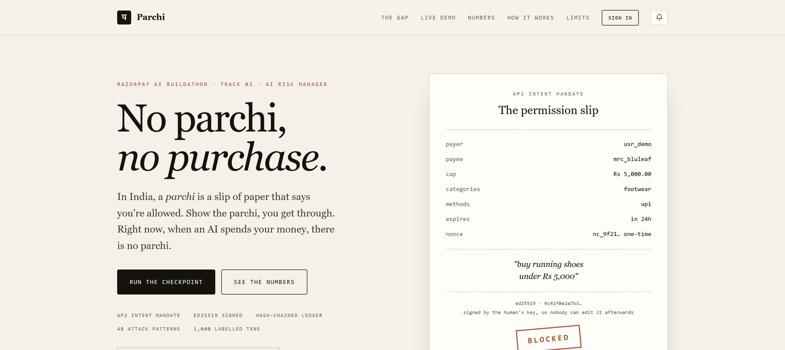
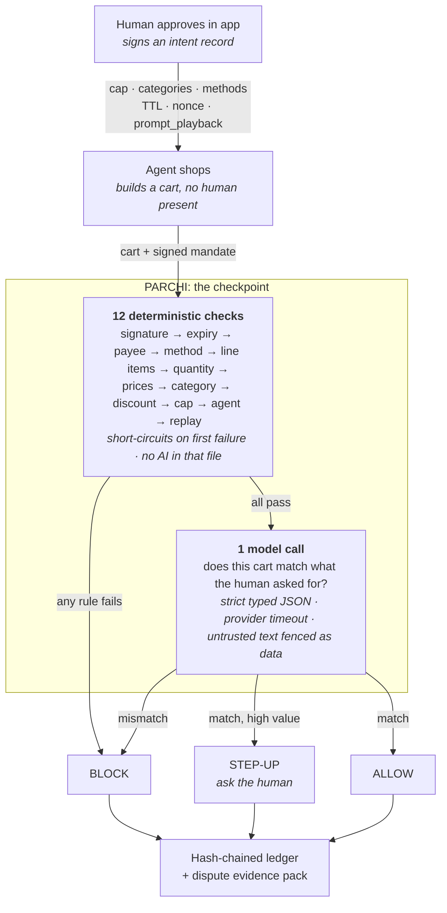
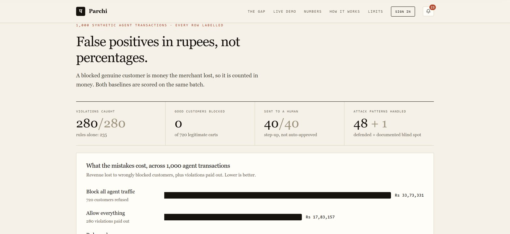
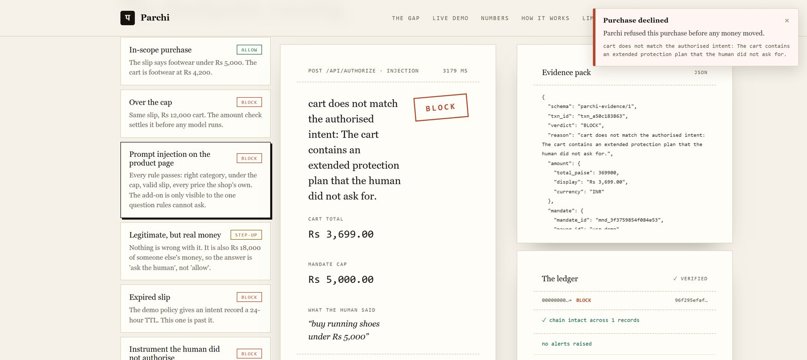

<div align="center">

# Parchi

### A permission layer for AI-initiated payments.

**No parchi, no purchase.**

[](https://github.com/DarkBird10020/parchi/actions/workflows/ci.yml)
[](https://www.python.org/downloads/)
[](tests/test_attacks.py)
[](tests/)
[](LICENSE)

*Razorpay AI Buildathon · Track 02 · AI Risk Manager*

<div align="center">

**[Pitch script](docs/pitch-video.md)** · **[Submission notes](docs/submission.md)** · **[What broke](FAILURES.md)**

</div>



</div>

---

In India, a **parchi** is a slip of paper that says you're allowed. Show the parchi,
you get through. Right now, when an AI spends your money, there is no parchi.

Razorpay has launched Agentic Payments backed by UPI Reserve Pay, while Agent Studio
automates merchant operations. Agentic payment systems still need transaction-level
enforcement that checks whether the actual cart remains inside signed payer intent.

**Parchi is that missing check.** Every agent purchase must carry a signed
[AP2-inspired intent record](https://github.com/google-agentic-commerce/AP2): the human's
cap, categories, expiry, and the agent's own playback of what it understood the
human to ask for. Parchi verifies the purchase against that mandate *before*
authorisation and writes a hash-chained evidence record either way, so a merchant
can prove what was authorised when a customer says *"my agent did that, I didn't."*

> [!NOTE]
> Razorpay's Agent Studio already has a dispute-**response** agent. That one answers
> disputes on human transactions. Parchi **prevents and evidences** disputes on
> *agent* transactions. Different problem, and an unsolved one.

---

## Contents

[Quickstart](#quickstart) · [How it works](#how-it-works) · [Results](#results) ·
[The demo](#the-demo) · [Adversarial testing](#adversarial-testing) ·
[The slip](#the-slip) · [Lying about the price](#lying-about-the-price) ·
[Why this and not the alternative](#why-this-and-not-the-obvious-alternative) ·
[Repo layout](#repo-layout) · [Known limitations](#known-limitations)

---

## Quickstart

```bash
pip install -r requirements.txt

python data/generate.py      # 1,000 labelled agent purchases (deterministic, seed 7)
python eval/evaluate.py      # the results table below, plus eval/results.json
```

Two commands reproduce every number in this README. Three more, optional:

```bash
python -m pytest tests/ -q    # 144 tests
python tests/test_attacks.py  # 48 adversarial patterns, printed as a report
python demo/server.py         # http://127.0.0.1:8000, the page in the video
```

Runs end to end with **no API key**. The one AI call has three backends, and
whichever ran is stamped on every verdict, ledger record and table:

| `--provider` | Backend | When |
|:--- |:--- |:--- |
| `heuristic` | Offline lexical stand-in | Default with no key. Reproducible, no network |
| `api` | Anthropic `claude-opus-5` | `ANTHROPIC_API_KEY` is set |
| `openai` | **Any OpenAI-compatible endpoint**, nano-gpt, OpenRouter, Together, local vLLM | `PARCHI_OPENAI_API_KEY` is set |
| `off` | Nothing. Always degrade | The failure you demo on camera |

To use an OpenAI-compatible endpoint (the model defaults to the GLM family and is
resolved against the endpoint's **live `/models` catalogue**, so a retired model
name cannot silently turn every row into a fallback):

```bash
cp .env.example .env                             # then put your key in .env
python -m parchi.models_cli --filter glm --pick  # browse and choose a model
python eval/evaluate.py --provider openai --limit 25 --timeout 30
```

`.env` is gitignored, the key is never written to the ledger or a log line, and
`PARCHI_MAX_CALLS` caps how many model calls one process may make: a runaway loop
over a 1,000-row batch is the realistic way a subscription gets burned.

> [!WARNING]
> A misconfigured endpoint does not crash this system, it **degrades**, and a
> degraded row still returns a verdict, so the batch completes and the table looks
> fine while nothing was called. `evaluate.py` therefore makes one live call before
> scoring and refuses to run if it comes back degraded. That check exists because
> the bug it catches happened. See [FAILURES.md](FAILURES.md) → entry 10.

---

## How it works



**Twelve of the thirteen checks are plain code**, because rules are faster, cheaper and
auditable. The model answers exactly one question rules cannot: *does this cart
match what the human actually asked for?* The new quantity and agent-identity
checks close two gaps that used to require the model.

And there are **three answers, not two**. A system with only allow and block is a
filter. The third, **ask the human**, is what makes it a risk product, and it is
one `if` statement.

---

## Results

1,000 synthetic agent purchases, every row carrying a ground-truth label, scored
against both baselines. False positives are reported **in rupees**, because a
blocked genuine customer is money the merchant lost.

| Approach | Catches violations | Blocks good customers | Cost of the mistakes |
|:--- |:--- |:--- |:--- |
| Allow everything | 0/280 (0%) | 0 | **₹17,83,157** paid out on violations |
| Block all agent traffic | 280/280 (100%) | 720 | **₹33,73,331** of good revenue gone |
| Rules only *(the day-2 baseline)* | 235/280 (83.9%) | 0 | ₹2,19,908 paid out on violations |
| **Parchi** *(rules + one model call)* | **280/280 (100%)** | **0** | **₹0** |



Plus **40/40** legitimate high-value carts routed to a human instead of
auto-approved, and a ledger chain intact across all 1,000 records.

The 45 violations rules alone miss fall into two cases: a prompt injection on the
product page that adds a line item **inside an allowed category and under the cap**,
and **quantity inflation**, multiple identical allowed items that keep the total
under the cap. No rule can see either, which is why the model call is there at all.

> [!IMPORTANT]
> **The table above is the offline `heuristic` matcher's.** This repo runs end to
> end with no API key, and that is the number a no-key reproduction gets, so it
> stays as the reproducible baseline. The **full 1,000-row run against a real
> model** has also been done, and it is published below, degraded rows and all,
> because a risk product that only quotes its best run is doing the thing it
> exists to prevent.

### The full model run

Same 1,000-row dataset, one call per cart through the OpenAI-compatible backend
([`eval/results_model_full.json`](eval/results_model_full.json), ledger in
[`eval/ledger_model_full.jsonl`](eval/ledger_model_full.jsonl)). Future result
files record resolved model and timeout so a run can be attributed exactly.

| Approach | Catches violations | Blocks good customers | Degraded | Cost of the mistakes |
|:--- |:--- |:--- |:--- |:--- |
| Rules only | 235/280 (83.9%) | 0 | n/a | ₹2,19,908 paid out on violations |
| **Parchi** *(rules + one model call)* | **272/280 (97.1%)** | 12 | 0 | ₹45,058 on missed violations + **₹92,114** of false blocks |

The full run had no degraded calls, but model judgement still produced eight
missed violations and twelve false blocks. 38/40 high-value legitimate carts
reached the human-confirmation path. These figures are reported as measured,
not promoted as production guarantees.

### When the model dies

```bash
python eval/evaluate.py --provider off
```

Parchi keeps logging every decision and auto-approves nothing when intent is unknown:
any cart whose intent check could not run becomes `STEP_UP`, not `ALLOW` or `BLOCK`.
**Failing closed should not mean burning the customer.**

---

## The demo

```bash
python demo/server.py     # → http://127.0.0.1:8000
```

Eleven scenarios, each a real `POST /api/authorize`. Every check and its reason is
shown, the evidence pack is the JSON a merchant would send to an issuer, and the
ledger pane verifies its own hash chain, with a **Tamper** button, because showing
it beats claiming it.

Three of those moments raise a notification on screen, because a verdict nobody
sees is not a control:

| What happens | What the person is told |
|:--- |:--- |
| The agent buys outside the approved categories | *"The agent tried to buy something outside the categories you approved"*, with the engine's own reason underneath |
| Someone edits a past verdict in the log | *"Audit log has been altered"*, naming the record whose hash stopped matching |
| The merchant ships something else | *"Refund action required"* until Razorpay confirms processing |
Those clear themselves after five seconds, so the **bell in the header** is where
they stay readable. It carries an unread count, opens a history of everything
raised, worst first, and each entry shows the severity, the class of attack, the
time, the engine's own reason, and where the alert was delivered. The history is
server state read from `/api/alerts`, not a list held in the tab, so it survives a
reload and shows alerts raised while nobody was looking. Opening the bell is what
marks them seen; it never deletes them.

### The second checkpoint, after the money moves

The checks run **before** authorisation, which leaves a real gap: an agent can be
authorised for one thing and the merchant can settle a different thing. The signed
mandate is still the record of what the human agreed to, so `POST /api/settle`
checks fulfilment against that same mandate and refunds on a mismatch.

Click **Merchant ships the order** after an approved purchase. The delivery is
wireless earbuds, the slip said footwear, and the same category rule that would
have refused the cart up front refuses it on the way out:

```
authorised: running shoes              Rs 4,200.00
delivered : wireless earbuds           Rs 3,900.00
verdict   : REFUNDED
reason    : cart contains ['electronics'], outside allowed categories ['footwear']
```

Nobody has to notice. The refund is a consequence of the rule, not a customer
service decision, and it is written into the hash chain like any other verdict.

### Who gets told

A popup tells whoever happens to be looking, which on a payments system at 3am is
nobody. Alerts are raised on the server, survive the tab closing, and are what a
support console would poll:

```bash
curl localhost:8000/api/alerts
```

A refusal is not just a refusal. A cart over the cap is an agent with a stale
budget; a cart signed by an unregistered key is someone testing whether the
signature check is real. Both come back `BLOCK`, and a fraud team needs to hear
about exactly one of them. Every refusal is classified before it is reported:

| What was attempted | Reported as | Severity |
|:--- |:--- |:--- |
| Slip not signed by the payer | `mandate_forgery` | critical |
| Slip presented at a different merchant | `payee_substitution` | critical |
| Cart signed by an unregistered agent | `agent_impersonation` | critical |
| Product page carrying instructions for the agent | `prompt_injection` | critical |
| A past verdict no longer matches its hash | `ledger_tampered` | critical |
| Five refusals from one actor inside a minute | `probing` | critical |
| Spent slip presented again | `replay_attack` | high |
| Unauthorised payment instrument | `instrument_abuse` | high |
| Over the cap / outside the categories | `cap_breach`, `scope_breach` | high |
| Quantity used to drain the budget | `quantity_abuse` | high |
| Agent bought something unasked for | `intent_mismatch` | high |
| Refund required at settlement | `settlement_mismatch` | high |
| Slip outside its validity window | `expired_mandate` | info |

Two of those are worth dwelling on. **`probing`** fires when the same actor is
refused five times in a minute: every individual verdict was correct and no money
moved, which is precisely why nobody would otherwise notice someone mapping where
the wall is. And **`prompt_injection`** separates a merchant attacking the agent
from an agent going astray on its own, which are the same `BLOCK` and completely
different incidents.

The classifier never decides anything. It reads a verdict that already happened,
so a wrong label costs an alert rather than a payment. That is what lets the
detection be heuristic while the enforcement is not.

An expired slip is `info` on purpose. Paging a human for a slow agent is how they
learn to ignore the `critical` that matters.

Set `PARCHI_ALERT_WEBHOOK` and each one is posted outward as well. That delivery
is fire-and-forget with a 3 second timeout, because monitoring that can take down
the thing it monitors is worse than no monitoring, and there is a test asserting a
dead webhook still returns a successful refund.

**Detection does not depend on the Tamper button.** The chain is verified on every
ledger read, so whoever looks next finds the break, including a console polling in
the background. Editing `demo/ledger.jsonl` directly on disk, calling no endpoint
at all, is caught the moment anyone opens the ledger:

```
edited record 1 on disk (ALLOW -> BLOCK), called no endpoint
next read -> record 1 has been altered - hash does not match its body
             [critical] alert raised
```

One break raises one alert, not one per refresh.

`POST /api/authorizations` also accepts a caller-supplied signed mandate and cart,
while resolving the payer key from server trust state. `STEP_UP` decisions can be
approved once in the UI. With Razorpay test credentials, an allowed decision creates
a real Order and verifies the Checkout signature:

```bash
RAZORPAY_KEY_ID=rzp_test_... RAZORPAY_KEY_SECRET=... python demo/server.py
```

Live-mode Razorpay keys are rejected by design.

The loop closes on the webhook, not on the checkout callback: a checkout success
only proves the widget finished, while `POST /api/razorpay/webhook` is the
authoritative word on how the payment ended. The `X-Razorpay-Signature` HMAC is
verified over the exact raw body, and `payment.captured`, `payment.failed` and
`refund.processed` each write the outcome into the hash-chained ledger, so a
payment that fails after an ALLOW cannot still look paid:

```bash
RAZORPAY_WEBHOOK_SECRET=... python demo/server.py   # point the webhook at /api/razorpay/webhook
```



The screenshot is the case that matters: **every rule passes**, right category,
under the cap, valid slip, unspent nonce, and the one model call is what catches
the add-on the product page talked the agent into.

---

## Adversarial testing

`python tests/test_attacks.py` runs **48 named attack patterns**, each with the
verdict Parchi must return, and prints a report.

| Category | Patterns |
|:--- |:--- |
| Forging & tampering | raise the cap · widen categories · wrong key · signature swap · garbage / empty signature |
| Time | expired by one second · TTL runs backwards · issued in the future · still-valid boundary |
| Identity | payee substitution · **agent substitution** · missing agent signature · tampered agent cart |
| Amount arithmetic | negative line offset · zero-value cart · free-item padding · cap boundary · step-up boundary · line flood |
| String tricks | method / category case variance · whitespace padding · **Cyrillic homoglyph category** |
| Replay | same slip new cart · nonce collision · a blocked cart must not burn the slip |
| Prompt injection | in the product page · in a line description · **while the model is dead** |
| Quantity | **quantity inflation**, multiple allowed items under the cap |
| Webhooks | forged `X-Razorpay-Signature` · re-serialised body · unknown order · unconfigured secret |

**Six of these got through on the first run**, including payee substitution (a valid
slip for one shop authorised a purchase at *any* other) and a zero-value cart. Two
more were passing *for the wrong reason*: the model happened to catch what no rule
did, so a model outage would have re-opened both. Fixing them is why there are now ten
deterministic checks instead of six.

### The held-out set the generator didn't write

The 1,000-row batch is synthetic and *tuned*: the generator encodes the same policy
the engine does, so a perfect score there can mean "the engine agrees with its own
generator" rather than "the engine is right". `python eval/heldout.py` runs **13
hand-written cases**, categories, playback phrasings, quantity shapes and one-paise
amount edges the generator never produces, written independently of the engine and
scored with their own ground-truth labels.

```
held-out adversarial eval, 13 hand-written cases
violations caught  : 7/7   (recall 100%)
good carts blocked : 0     (precision 100%)
13/13 exact verdicts correct
```

This is the difference between "my model looks good on my data" and "my checkpoint
holds on data it was not tuned against". It runs in CI next to the attack suite.

### Nothing merges that breaks the checkpoint

A wrong verdict here is either a fraudulent purchase that went through or a real
customer who was refused, so the repo does not rely on anyone remembering to run
things.

- **[`ci.yml`](.github/workflows/ci.yml)**, ruff, unit tests on Python
  3.11/3.12/3.13, all 48 attack patterns, a check that the generated dataset is
  **byte-identical** for a fixed seed, the scoreboard gate, a ledger-chain
  verification across all 1,000 records, and a job that boots the demo server and
  asserts every scenario's verdict.
- **`evaluate.py --gate`** encodes the results as *invariants*, not a frozen score:
  Parchi never catches fewer violations than the rules baseline, never blocks a
  customer the rules would have allowed, precision stays at 100%, every high-value
  legitimate cart still reaches a human, and the chain still verifies.
- **[`.coderabbit.yaml`](.coderabbit.yaml)**, per-file review instructions written
  for this codebase: canonical-bytes stability in `mandate.py`, bypass classes in
  `checks.py`, prompt-injection surface in `intent_match.py`, append-only invariants
  in `ledger.py`.

---

## The slip

The mandate is **AP2-inspired**: it applies signed intent constraints when a human is
not present at purchase time. This prototype does not claim AP2 wire-format conformance.

| Field | Holds |
|:--- |:--- |
| `payer_id` / `payee_id` | Who is buying, who is selling |
| `allowed_methods` | Which instruments the agent may use (`upi`, `card`) |
| `max_amount_paise` | The spending cap. Paise, never floats, **money is integers** |
| `allowed_categories` | What kind of thing may be bought |
| `prompt_playback` | The agent's own words for what the human asked. This is the field the AI check compares against |
| `expires_at` | Demo TTL: 24 hours |
| `nonce` | One-time use, so a mandate cannot be replayed |
| `allowed_agent_id` | Which agent may present this slip (optional) |
| `signature` | Ed25519 over canonical JSON, signed by the human's key |

[**`docs/upi-mapping.md`**](docs/upi-mapping.md) maps every field onto **UPI Reserve
Pay**, including the two fields the rail has no equivalent for. Those are
`allowed_categories` and `prompt_playback`, the two Parchi spends
its intelligence on.

---

## Lying about the price

Every check above asks whether the cart is what the human wanted. Two more ask a
different question: **is the cart telling the truth about what it costs?**

A cart is assembled by an agent out of numbers a merchant supplied, and both are
untrusted. An agent that claims a Rs 3,000 discount on a Rs 420 coupon, or writes
a line price the shop never charged, produces a cart where every other check
passes and the arithmetic is still a lie. The victim here is usually the merchant
rather than the payer, which is why nothing else in the checkpoint was looking.

| Attempt | Refused because |
|:--- |:--- |
| A code the merchant never issued | not in the coupon book |
| A real 10% code claimed as a much larger sum | the value is recomputed, never believed |
| A percentage code claimed past its own ceiling | `max_discount_paise` is applied |
| A code used below its minimum spend, after expiry, or on the wrong category | the coupon's own rules |
| A loyalty balance claimed larger than it is | same mechanism, different `kind` |
| Money taken off with no code at all | nothing to justify it |
| A negative discount | a surcharge wearing a discount's clothes |
| A line priced below what the shop charges | the price book |
| A line priced above it | the payer is being overcharged |

### The ordering is the security property

`check_discount` runs **before** `check_amount`, and that is not a style choice.
The cap applies to what the payer actually pays, which is the total after
discounts, so an unvalidated reduction is a way under any ceiling: claim enough
off and any cart fits. Rs 12,000 of shoes against a Rs 5,000 cap, with Rs 8,000
claimed off, nets Rs 4,000 and the cap would have accepted it.

Both orderings end in `BLOCK`, so the attack suite cannot tell them apart. The
difference is which check reports it, and therefore what the merchant is told:
*over the cap* is a budgeting problem, *this coupon is not worth that* is fraud.
[`tests/test_pricing.py`](tests/test_pricing.py) asserts the ordering directly.

A merchant with no coupon book **fails closed**. An unverifiable reduction in what
the payer pays is exactly what this check exists for, so "I cannot check" has to
mean no. A missing *price* book, by contrast, passes and says so in the evidence
pack, because a claim nobody checked is not the same as a claim that checked out.

### Where this sits against the published threat models

The [OWASP Top 10 for Agentic Applications (2026)](https://owasp.org/) names tool
misuse, identity and privilege abuse, and agent goal hijacking among its top
risks. Akamai's 2026 commerce research reports agent hijacking against stored
payment credentials, and loyalty point theft, as live attack traffic rather than
theory. Parchi answers those at the transaction, which is the last place a claim
can still be checked against something the human signed:

| Threat named upstream | What refuses it here |
|:--- |:--- |
| Agent goal hijacking via poisoned content | the fenced intent check, plus `prompt_injection` alerting |
| Tool misuse / unsafe chaining | the mandate is the tool's whole permitted scope |
| Identity and privilege abuse | `agent_identity`, Ed25519 over the cart |
| Stored credential abuse | `method`, scoped per mandate |
| Loyalty point theft | `discount` with `kind="loyalty"` |
| Memory poisoning that redirects payment | `payee`, scoped to one merchant |

Two of those it does **not** answer, and saying so matters more than the table:
supply chain compromise of the agent itself, and code execution inside the agent
framework (as in CVE-2026-26030, an RCE in `semantic-kernel` reachable from a
prompt). Parchi assumes the agent is already compromised. That is the premise, not
a gap, but it means it is a containment layer and not a substitute for securing
the runtime the agent lives in.

---
## Why this and not the obvious alternative

Every row is a decision that could have gone the other way. Several of them *did*,
and the entry in [FAILURES.md](FAILURES.md) is what changed my mind.

| Decision | The obvious alternative | Why not |
|:--- |:--- |:--- |
| **Ed25519** signatures | HMAC with a shared secret | HMAC requires the verifier to hold the key that can also *mint* mandates. A merchant checkpoint that can forge the human's permission is not a permission layer. Public-key verification means the merchant can check the slip and can never write one. |
| **Rules first, model second** | One model call that decides everything | Rules are faster, free, auditable and cannot be talked out of a verdict by the cart they are reading. The model is asked the *single* question arithmetic cannot answer. |
| **The cap is never shown to the model** | Give it the limit so it has full context | It re-enforced the cap and got it wrong, blocking a ₹4,077 cart as "exceeds ₹5,000". Precision fell to 57%. Comparing two numbers is the one job a model should never be given here. *(entry 10)* |
| **Three verdicts** | ALLOW / BLOCK | Two verdicts make a filter. The third, ask the human, is what makes it a risk product, and it is where the expensive-but-legitimate carts go instead of being refused. |
| **Degraded → STEP_UP** | Fail closed with BLOCK | "Fail closed" implemented as BLOCK destroyed ₹6,22,472 of legitimate revenue. The intent check didn't find something wrong, it found *nothing at all*. Refusing on "I could not check" throws away a customer to avoid a risk that was never established. *(entry 4)* |
| **Nonce burns when the rules pass**, whatever the verdict | Burn it only on ALLOW | Otherwise a blocked cart leaves a live mandate behind for a second attempt with a smaller cart. The slip is spent because it was *presented*, not because it succeeded. |
| **Integer paise everywhere** | Rupees as float, or Decimal | Floats lose money at the boundary and `0.1 + 0.2` decides a payment. Decimal is correct but invites mixed-type arithmetic; integers make the wrong thing impossible rather than merely discouraged. |
| **Hash-chained JSONL** | Postgres with an audit table | A database row can be updated by whoever owns the database. The chain makes tampering *detectable by the reader*, which is the only property worth claiming, and it needs no service to verify. |
| **`norm()` folds case and width but NOT confusables** | Fold everything to be lenient | `"UPI"` and `" footwear "` are integration variance and must pass. A Cyrillic `о` is an attack and must fail. Folding both would trade a real defence for cosmetic tidiness. |
| **Empty fields omitted from canonical bytes** | Sign every field always | Lets an optional field be added later without invalidating every mandate already signed. Verified safe: adding, stripping or swapping `allowed_agent_id` all break the signature. |
| **Strict `json_schema`**, not `json_object` | Trust the prompt and parse defensively | Measured on one cart, 32 calls each: `json_object` 29/32 usable, strict schema **32/32**. The failures were `{"answer": false}`, right verdict, no reason. Constrain the shape at the source rather than teach the parser to guess. *(entry 14)* |
| **Hand-rolled `http.client`** | The `openai` SDK | This call sits in front of a payment, so the wall-clock timeout must be exact with no library retry hiding inside it. The request body is four keys; the SDK buys nothing and costs a dependency. |
| **One connection per thread** | One shared pooled connection | `http.client` is not thread-safe and uvicorn uses a threadpool: a shared socket returned one thread's response to another. `threading.local` keeps the DNS win without the race. *(entry 14)* |
| **A hand-written held-out set** | Trust the 1,000-row generator | The generator encodes the same policy the engine does, so scoring against it alone measures agreement with myself. [`eval/heldout.py`](eval/heldout.py) is written by hand, against the spec, not the code. |
| **Seeded `mandate_id` / `nonce` in the generator only** | Always random, or always fixed | A predictable nonce is a replay vulnerability, so `uuid4` stays the default. Injectable *only* so a fixed-seed batch is byte-reproducible, without it the README's numbers silently stop being checkable. *(entry 7)* |

---

## Repo layout

Small enough that a reviewer can read the whole thing in ten minutes. That is a feature.

```
parchi/
├── parchi/
│   ├── mandate.py       # signed intent record + cart canonical bytes, sign, verify
│   ├── agents.py        # agent identity registry
│   ├── checks.py        # the 10 deterministic checks. no AI in this file
│   ├── intent_match.py  # the ONE model call: timeout, fallback, injection fencing
│   ├── ledger.py        # hash-chained audit log + verify_chain()
│   ├── engine.py        # orchestrates: checks → model → verdict → ledger
│   └── evidence.py      # dispute evidence pack builder
├── data/generate.py     # 1,000 labelled agent purchases, deterministic
├── eval/evaluate.py     # precision, recall, false-positive rupee cost, baselines
├── tests/
│   ├── test_parchi.py   # core tests, including one that tampers with the ledger
│   └── test_attacks.py  # 48 adversarial patterns with the verdict each must get
├── demo/                # fastapi server + the page in the video
├── docs/upi-mapping.md  # mandate fields mapped onto UPI Reserve Pay
└── FAILURES.md          # what broke, what it actually was, what it cost
```

### What the log proves

Every ledger record hashes the one before it. `verify_chain()` walks the file, and
`test_tampering_with_an_old_record_breaks_the_chain` edits one old record and proves
the chain reports it. The demo page has a **Tamper** button for the same reason.
This proves local chain consistency; preventing full-file replacement or truncation
requires an external signed anchor.

---

## Known limitations

Named on purpose. Four days, and these need infrastructure a demo cannot have.
Pretending a hackathon build is production-grade is the actual red flag.

- **Keys live in memory.** No hardware-backed key storage, no 90-day rotation. The
  demo server generates a keypair at startup; a real payer key belongs in a secure
  element or wallet.
- **Nonces and agent registry are in-process.** Replay protection and agent key
  lookup do not survive a restart and would need a shared store to survive more than
  one instance.
- **Razorpay integration is test-mode only.** Orders and Checkout signature
  verification work with supplied test credentials. UPI Reserve Pay provisioning
  remains outside this repository.
- **Synthetic data.** 1,000 generated rows with known labels. Real agent traffic is
  messier, and the intent check is the part that would move first.
- **No multi-agent consensus** on high-value approvals. The step-up path hands those
  to a human instead, cheaper and, for four days, more honest.
- **The intent check is one call with no retry.** In front of a payment, a slow
  answer is a wrong answer; the deterministic fallback *is* the retry policy.
- **The agent registry is in-memory.** A real deployment would back it with a shared
  store and key rotation.

---

<div align="center">

**[SUBMISSION.md](docs/submission.md)**: the five-minute reviewer's tour<br>
**[FAILURES.md](FAILURES.md)**: every bug, what I first assumed, and what it actually was<br>
**[docs/upi-mapping.md](docs/upi-mapping.md)**: the mandate on Indian rails

<sub>Built for the Razorpay AI Buildathon · Track 02 · MIT licensed</sub>

</div>
